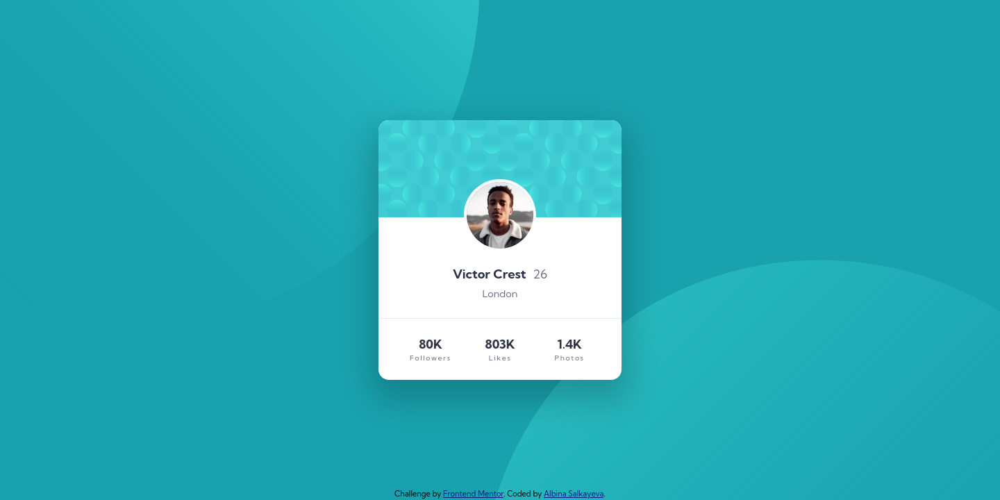

# Frontend Mentor - Profile card component solution

This is a solution to the [Profile card component challenge on Frontend Mentor](https://www.frontendmentor.io/challenges/profile-card-component-cfArpWshJ). Frontend Mentor challenges help you improve your coding skills by building realistic projects. 

## Table of contents

- [Overview](#overview)
  - [The challenge](#the-challenge)
  - [Screenshots](#screenshots)
  - [Links](#links)
- [My process](#my-process)
  - [Built with](#built-with)
  - [What I learned](#what-i-learned)
- [Author](#author)

## Overview

### The challenge

- Build out the project to the designs provided

### Screenshots

|Desktop|Mobile|
|:-:|:-:|
|||

### Links

- Solution URL: [https://github.com/albina0104/profile-card-component](https://github.com/albina0104/profile-card-component)
- Live Site URL: [https://albina0104.github.io/profile-card-component/](https://albina0104.github.io/profile-card-component/)

## My process

### Built with

- Semantic HTML5 markup
- CSS custom properties
- Flexbox
- Mobile-first workflow


### What I learned

- I learned how to position images for background. As the `background-position` property did not help to position the circles as needed, I created a container with absolute positioning that takes all available space and is placed behind the main content, and placed images inside it, and positioned them also absolute. The container has the property `overflow: hidden`, so the unnecessary parts of the background circles will not be shown. And it does not affect the main content - the content still can be scrolled if needed, as the container is taken out of the normal document flow.

```html
<div class="img-bg-container">
  
  
</div>
```
```css
.img-bg-container {
    position: absolute;
    top: 0;
    bottom: 0;
    left: 0;
    right: 0;
    z-index: -1;
    overflow: hidden;
}

.img-bg {
    position: absolute;
}

.img-bg-top {
    right: 52%;
    bottom: 35%;
}

.img-bg-bottom {
    top: 52%;
    left: 48%;
}
```

- While doing the challenges, I always wanted to achieve the following:
  - the card should be positioned at the exact center of the screen;
  - the attribution should be positioned at the bottom;
  - they should not overlap on small screens;
  - it should be possible to scroll the page on small screens without any issues, all content from top to bottom should be visible.
  
  In my 6 previous challenges, the card was placed in the center of the free space which is left from the row of text below.

  On the 7th challenge I finally realized how I can place the card at the center and reduce the possibility of side effects. I made a padding for the body, and placed the attribution absolutely on top of the padding. On very narrow screens the attribution is on 2 rows, so for such narrow screens I increased the bottom padding size.

Card placing:

```css
body {
    display: flex;
    flex-direction: column;
    min-height: 100vh;
    min-height: 100dvh;
    ...
}

.card {
    ...
    margin: auto;
    ...
}
```

Attribution placing:

```css
body {
    ...
    padding: 1.2rem 0;
    position: relative;
}

.attribution {
    font-size: 0.688rem;
    text-align: center;
    padding-top: 10px;
    position: absolute;
    bottom: 0.1rem;
    left: 50%;
    transform: translateX(-50%);
    width: 100%;
}

@media screen and (max-width: 20rem) {
    body {
        padding: 1.2rem 0 2.4rem 0;
    }
}
```

## Author

- Frontend Mentor - [@albina0104](https://www.frontendmentor.io/profile/albina0104)
- GitHub - [albina0104](https://github.com/albina0104)
